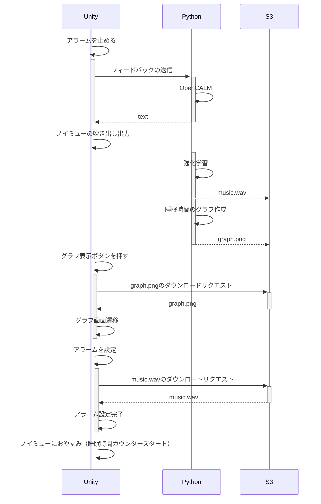

# Noimu | TNuts

### シーケンス

```mermaid
sequenceDiagram
    participant Unity
    participant Python
    participant S3

    Unity->>+Unity: アラームを止める
    activate Unity
    Unity->>+Python: フィードバックの送信
    activate Python
    Python->>Python: OpenCALM
    Python-->>Unity: text
    deactivate Unity
    deactivate Python
    Unity->>+Unity: ノイミューの吹き出し出力
    activate Python
    Python->>Python: 強化学習
    Python-->>S3: music.wav

    deactivate Python
    activate Python
    Python->>Python: 睡眠時間のグラフ作成
    Python-->>S3: graph.png
    deactivate Python

    Unity->>Unity: グラフ表示ボタンを押す
    activate Unity
    Unity->>+S3: graph.pngのダウンロードリクエスト
    S3-->>-Unity: graph.png
    Unity->>Unity: グラフ画面遷移
    deactivate Unity

    Unity->>+Unity: アラームを設定
    activate Unity
    Unity->>+S3: music.wavのダウンロードリクエスト
    S3-->>-Unity: music.wav
    Unity->>Unity: アラーム設定完了
    deactivate Unity

    Unity->>+Unity: ノイミューにおやすみ（睡眠時間カウンタースタート）
```