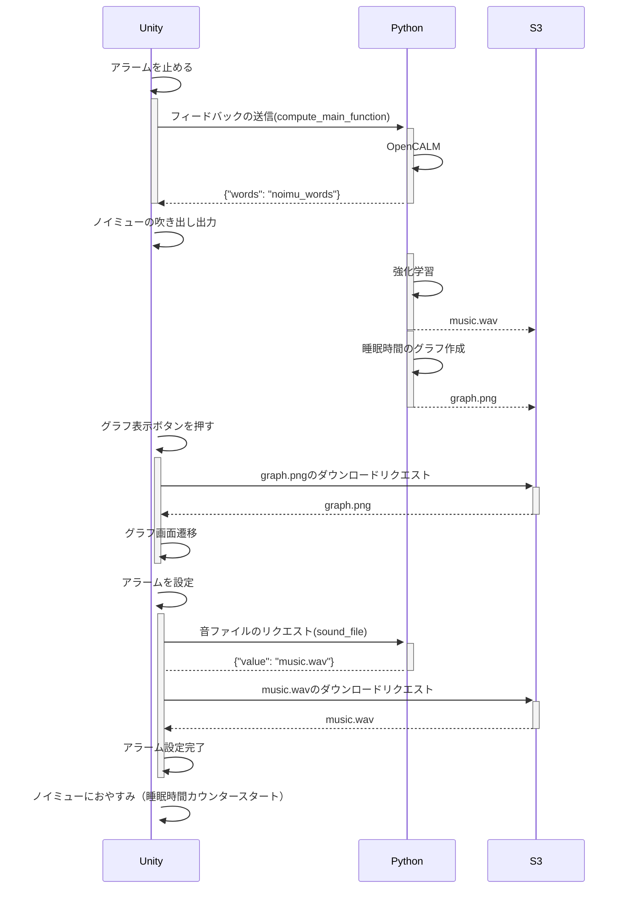

# Noimu | TNuts

### シーケンスフロー


### MQTT通信仕様

```
# Unity => Python

## フィードバックの送信
msg = {
    "request": "compute_main_function",
    "feedback": {
        "elapsed_time": 999,
        "sleep_time": 999,
    },
}


## 音ファイルのリクエスト
msg = {
    "request": "sound_file",
}


# Python => Unity

## ノイミューの言葉の送信
msg = {
    "request": "noimu_words",
    "value": "おはよ〜、今日の睡眠時間はxx時間で、・・・",
}


## 音ファイルのレスポンス
msg = {
    "request": "sound_file",
    "value": "music.wav",
}
```

### OpenCALMのLoRMファインチューニング

参考:
https://note.com/npaka/n/na5b8e6f749ce

データセット: @kun1em0nさんの[「kunishou/databricks-dolly-15k-ja」](https://github.com/kunishou/databricks-dolly-15k-ja)
